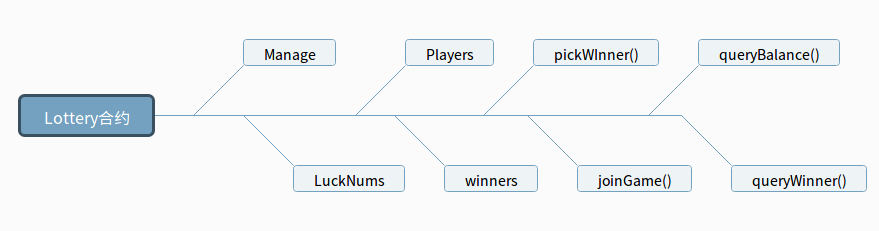

# 币幸

 基于以太坊智能合约创建的夺宝程序，在算法层面保证了保证了公平性，不可篡改。项目基于Truffle框架开发，类似夺宝系统。目前网络上的彩票，一元夺宝等游戏，都是高度中心化的系统，对于其开奖的真实性，有效性，公平性都难以保证。同时基于中心化的系统容易受到信息篡改，破坏等危险。而基于区块链技术实现的系统可以完美的解决以上问题，本项目采用以太坊作为载体，实现了去中心化的开奖
 项目架构图如下
 
 

> 合约成员变量

参数 | 类型 | 描述
- | :-: | -:
manage | address| 记录合约创建者地址
luckNums | mapping (uint256=>uint256) | 记录每个Game的幸运数
players | mapping (uint256=>address[]) | 记录每个Game的参与者
winners|mapping (uint256=>address)|记录每个Game的幸运儿

> 合约方法

方法名|入参|出参|描述|权限
- | :-: | :-: | :-: | -:
constructor|全局msg|无|合约构造函数，用于初始化manage参数 | 合约创建者
joinGame | ternNum(Game 编号) | 无 | 用户调用参与一场夺宝Game| 普通用户
pickWinner | ternNum(Game 编号) |无 | 管理员随机选择幸运用户|合约创建者
pickLuckNum | ternNum(Game 编号) |无 | 随机生成幸运数字|合约创建者
queryBalance | 无|合约地址上的ETH余额| 查看合约账户余额|普通用户
queryWinner |ternNum(Game 编号) | address(获胜者地址) |查看指定ternNum的幸运者|普通用户

## 算法

```java
//生成幸运数
      function  pickLuckNum(uint termNum) private returns(uint256){
          require(msg.sender == manage);
          uint encode = uint(keccak256(manage,now,players[termNum]));
          uint256 luckNum = uint256(encode)%players[termNum].length;
          luckNums[termNum] = luckNum;
          return luckNum;
      }
```
采用以太坊keccak256将manage,now,players 进行hash加密得到加密数据。通过与当前Game参与人数进行取模，实现了幸运用户的生成，将数据记录在Winners中，在以太坊网络实现持久化

## 开发
项目依赖：Truffle(http://truffleframework.com/)

```javascript
安装 $ npm install -g truffle
编译 $ truffle compile
部署 $ truffle compile/deploy
测试 $ truffle test
```

 ##  测试


 ### Test in JavaScript
 安装mocha测试框架
 ```
$ npm install --global mocha
 ```
 引入依赖
 ```
 const Lottery = artifacts.require("Lottery");
const assert = require('assert');
 ```
创建UT
```
contract('Lottery', function(accounts) {
    it("query Lottery Balance", function() {
      return Lottery.deployed().then(function(instance) {
        return instance.queryBalance.call();
      }).then(function(balance) {
        assert.equal(balance.valueOf(), 0, "there is zero in the first account");
      });
    });
})
```


 ###  Test in Solidity
 引入依赖
 ```
import "truffle/DeployedAddresses.sol";
import "truffle/Assert.sol";
import "../contracts/Lottery.sol";      // 被测试合约
 ```
 创建测试合约
 ```
contract LotteryTest {
        Lottery lottery = Lottery(DeployedAddresses.Lottery());

        function testBalance() public {
           uint balance  =  lottery.queryBalance();
           assert(balance == 0);
        }
}
 ```


 ## 部署
 项目借助infura进行以太坊测试网络与主网络部署infura(https://infura.io/)

 依赖 truffle-hdwallet-provider
 ```
 $ npm install --global truffle-hdwallet-provider
 ```

 配置 truffle.js
 ```javascript
// 在这里我们需要通过 js 调用以太坊钱包，通过 npm install truffle-hdwallet-provider 安装这个库
var HDWalletProvider = require("truffle-hdwallet-provider"); 
var infura_apikey = "your apikey"; // infura 为你提供的 apikey 请与你申请到的 key 保持一致，此处仅为示例
var mnemonic = "your mnemonic"; // 你以太坊钱包的 mnemonic ，可以从 Metamask 当中导出，mnemonic 可以获取你钱包的所有访问权限，请妥善保存，在开发中切勿提交到 git
module.exports = {
  networks: {
    development: {
      host: "127.0.0.1",
      port: 8545,
      network_id: "*" // Match any network id
    },
    privatenet: {
      host: "127.0.0.1",
      port: 8989,
      network_id: "314590" // Match any network id
    },
    ropsten: {
      provider: function() {
        return new HDWalletProvider(mnemonic, "https://ropsten.infura.io/"+infura_apikey)
      },
      network_id: 3,
      gas: 4012388,
      gasPrice: 30000000000
    },
    main: {
      provider: function() {
        return new HDWalletProvider(mnemonic, "https://mainnet.infura.io/"+infura_apikey)
      },
      network_id: 3,
      gas: 22388,
      gasPrice: 2
    }
  }
};

 ```

truffle命令部署
```
truffle migrate --network $(network)
```
$(network) 对应部署的网络
